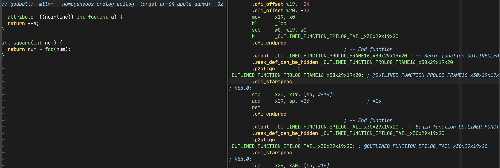
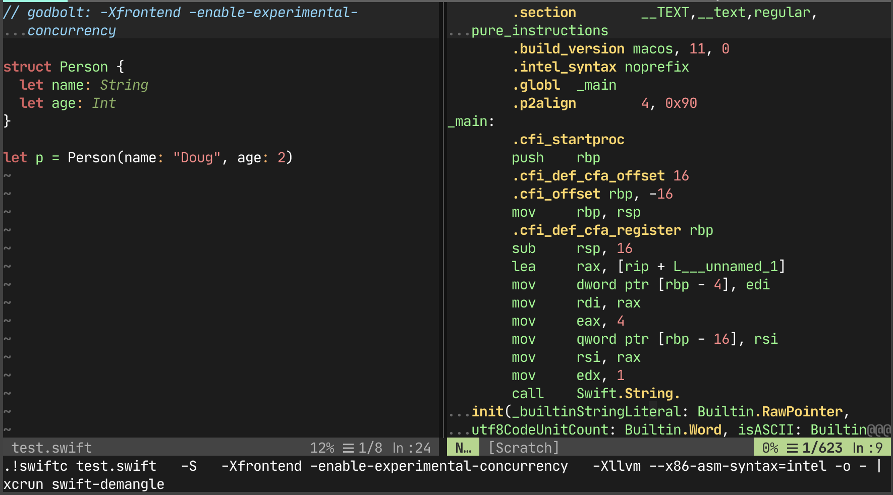

# godbolt.nvim

A powerful Neovim plugin that brings Compiler Explorer (godbolt.org) functionality directly into your editor. Compile your code to assembly, LLVM IR, or other intermediate representations in a split window, with bidirectional line mapping and LLVM optimization pipeline visualization.



## Features

- **Multi-format output**: Assembly, LLVM IR, ClangIR, AST dumps, and object files
- **Bidirectional line mapping**: Click on source code to highlight corresponding assembly/IR, and vice versa
- **LLVM pipeline viewer**: Step through optimization passes for both C/C++ files and LLVM IR
- **Multi-language support**: C, C++, Swift, and LLVM IR
- **Per-file compiler arguments**: Use comments to specify flags per file
- **Automatic output detection**: Intelligently detects output type from compiler flags
- **Clean output**: Separates warnings/errors from the main output buffer

## Screenshots

Basic assembly output:


Swift support with demangling:



## Quick Start

```lua
-- 1. Install the plugin using your package manager
{
  'lanza/godbolt.nvim',
  config = function()
    require('godbolt').setup()
  end,
}

-- 2. Open a C/C++ file and run
:Godbolt -O2

-- 3. To see LLVM optimization passes (C/C++ files):
:GodboltPipeline O2

-- Or for .ll files with custom passes:
:!clang -S -emit-llvm -O0 -Xclang -disable-O0-optnone % -o %:r.ll
:edit %:r.ll
:GodboltPipeline mem2reg,instcombine
```

## Installation

Using [lazy.nvim](https://github.com/folke/lazy.nvim):

```lua
{
  'lanza/godbolt.nvim',
  config = function()
    require('godbolt').setup({
      -- Your configuration here (see Configuration section below)
    })
  end,
}
```

Using [packer.nvim](https://github.com/wbthomason/packer.nvim):

```lua
use {
  'lanza/godbolt.nvim',
  config = function()
    require('godbolt').setup()
  end
}
```

**Requirements:**
- Neovim 0.7+
- `clang`/`clang++` for C/C++ compilation
- `swiftc` for Swift compilation (optional)
- `opt` (LLVM optimizer) for LLVM IR optimization and pipeline viewer (optional)

## Configuration

Configure the plugin in your `init.lua`:

```lua
require('godbolt').setup({
  -- Compiler paths (optional, uses these defaults)
  clang = 'clang',
  swiftc = 'swiftc',
  opt = 'opt',

  -- Default compiler arguments
  cpp_args = '-std=c++20',
  c_args = '-std=c17',
  swift_args = '',
  ll_args = '',

  -- Window configuration (optional)
  -- window_cmd = 'split' -- instead of default 'vertical botright new'

  -- Line mapping configuration (Godbolt-style source-to-assembly mapping)
  line_mapping = {
    enabled = true,         -- Enable automatic line mapping
    auto_scroll = false,    -- Auto-scroll windows when cursor moves (can be distracting)
    throttle_ms = 150,      -- Throttle cursor updates (ms) for performance
    silent_on_failure = false,  -- Show error messages if debug info is missing
    show_compilation_cmd = true,  -- Show compilation command when debug info fails
  },

  -- Pipeline viewer configuration
  pipeline = {
    enabled = true,         -- Enable pipeline viewer
    show_stats = true,      -- Show instruction and basic block statistics
    start_at_final = false, -- Start at first pass instead of final result
    filter_unchanged = false, -- Filter out passes that don't change the IR
  },
})
```

All fields are optional and will use sensible defaults if not specified.

## Commands

### Basic Compilation

**`:Godbolt [compiler-args]`**

Compiles the current file to assembly/IR in a new split window.

Examples:
```vim
:Godbolt              " Basic compilation
:Godbolt -O3          " With optimization
:Godbolt -O2 -march=native
:Godbolt -emit-llvm   " Output LLVM IR instead of assembly
:Godbolt -emit-cir    " Output ClangIR (MLIR)
```

### Pipeline Viewer

**`:GodboltPipeline [passes]`**

Runs LLVM optimization passes and opens an interactive 3-pane viewer showing each pass's transformations.

**Supported file types:**
- `.ll` files: Use custom pass lists or O-levels
- `.c`/`.cpp` files: Use O-levels only (O0, O1, O2, O3)

Examples:
```vim
" For C/C++ files - view frontend optimization passes
:GodboltPipeline O2                 " Use O2 optimization level
:GodboltPipeline O3                 " Use O3 optimization level

" For .ll files - use custom passes or O-levels
:GodboltPipeline                    " Use default O2 pipeline
:GodboltPipeline O3                 " Use O3 optimization level
:GodboltPipeline mem2reg,instcombine " Run specific passes

" Workflow for custom passes on C/C++ code:
" 1. First compile to LLVM IR with O0
:Godbolt -emit-llvm -O0 -Xclang -disable-O0-optnone
" 2. Then run custom passes on the .ll file
:edit %:r.ll
:GodboltPipeline mem2reg,sroa,instcombine
```

**Note:** For C/C++ files, custom pass lists are not supported due to clang's compilation model. Compile to `.ll` first if you need custom passes.

**Pass Scope Indicators:**

The pipeline viewer shows scope indicators for each pass:
- **[M]** - Module pass: operates on the entire module (all functions, globals)
- **[F]** - Function pass: operates on a single function
- **[C]** - CGSCC pass: operates on a call graph strongly-connected component

Module passes show the full module before/after, while function passes show only the specific function being optimized.

**Pipeline Navigation Commands:**

- **`:NextPass`** - Navigate to the next optimization pass
- **`:PrevPass`** - Navigate to the previous optimization pass
- **`:GotoPass [N]`** - Jump to pass number N (or show picker if N omitted)
- **`:FirstPass`** - Jump to the first pass
- **`:LastPass`** - Jump to the last pass

**Keybindings in Pipeline Viewer:**

In the pass list pane:
- `j`/`k` or `↓`/`↑` - Navigate between passes
- `Enter` - Select and view the pass under cursor
- `q` - Quit the pipeline viewer
- `g[` - Jump to first pass
- `g]` - Jump to last pass

In the before/after panes:
- `]p` - Next pass
- `[p` - Previous pass
- Standard diff commands (`]c`, `[c` for next/previous diff)

### Utility Commands

**`:GodboltDebug [on|off]`**

Toggle debug mode to see detailed logging for troubleshooting pipeline issues.

```vim
:GodboltDebug on       " Enable debug mode
:GodboltDebug off      " Disable debug mode
:GodboltDebug          " Toggle debug mode
```

**`:GodboltStripOptnone`**

Strip `optnone` attributes from the current LLVM IR file. Useful when you have IR compiled with `-O0` that you want to optimize.

```vim
:GodboltStripOptnone   " Strips optnone and reloads the buffer
```

**`:GodboltShowCommand`**

Show the last compilation command used by `:Godbolt`. Useful for debugging line mapping issues or understanding what flags were used.

```vim
:GodboltShowCommand    " Displays the last compilation command
```

## Usage Examples

### Per-File Compiler Arguments

You can specify compiler arguments directly in your source files using special comments on the first line:
```cpp
// godbolt: -O2 -march=native
int main() {
  return 42;
}
```

For assembly files (`.s`) or LLVM IR files (`.ll`), use `;` for comments:
```llvm
; godbolt: -O3
define i32 @main() {
  ret i32 42
}
```

These arguments are combined with any arguments passed to `:Godbolt`.

### Pipeline Comments

For LLVM IR files, you can also specify pipeline configuration in comments:

```llvm
; godbolt-pipeline: mem2reg,instcombine,simplifycfg
; godbolt-level: O3
```

### Output Type Detection

The plugin automatically detects the output type based on compiler flags and sets the appropriate filetype:

- **`-emit-llvm`** → LLVM IR (`filetype=llvm`)
- **`-emit-cir`** → ClangIR (`filetype=mlir`)
- **`-emit-ast`** → AST dump (`filetype=text`)
- **`-emit-obj`** or **`-c`** → Object file (shown via objdump, `filetype=asm`)
- **`.ll` files** → Always LLVM IR (`filetype=llvm`)
- **Default** → Assembly (`filetype=asm`)

Examples:
```vim
:Godbolt -emit-llvm -O2          " Outputs LLVM IR
:Godbolt -emit-cir               " Outputs ClangIR (MLIR)
```

Or use file-level comments:
```cpp
// godbolt: -emit-llvm -O3
int main() { return 42; }
```

### Warnings and Errors

Compiler warnings and errors are separated from the output and displayed in the message log (`:messages`) instead of cluttering the output buffer.

For example, if you run:
```vim
:Godbolt -masm=intel
```

You'll see in `:messages`:
```
clang++ "file.cpp" -S -fno-asynchronous-unwind-tables -masm=intel -std=c++20 -o -
clang: warning: argument unused during compilation: '-masm=intel' [-Wunused-command-line-argument]
```

While the output buffer will only contain the clean assembly output. This keeps your compilation output clean and readable while still preserving important diagnostic information.

### Line Mapping (Godbolt-style)

The plugin automatically maps source lines to compiled output lines (and vice versa), similar to godbolt.com's Compiler Explorer.

**How it works:**
- Move your cursor in the source file → corresponding assembly/IR lines are highlighted
- Move your cursor in the assembly → corresponding source line is highlighted
- Uses compiler debug information (`.loc` directives) for accurate mapping

**Features:**
- **Bidirectional mapping**: Source ↔ Assembly synchronization
- **Automatic**: Enabled by default, no manual setup needed
- **Performance optimized**: Throttled updates to prevent lag
- **Works at all optimization levels**: -O0, -O2, -O3, etc.

**Requirements:**
- Automatically adds `-g` flag to enable debug information
- **LLVM IR support**: Fully implemented (parses `!dbg` metadata)
- **Assembly support**: Work in progress

**To use LLVM IR (recommended):**
```vim
:Godbolt -emit-llvm
```

**Configuration:**
```lua
require('godbolt').setup({
  line_mapping = {
    enabled = true,         -- Enable/disable line mapping
    auto_scroll = false,    -- Auto-scroll windows (can be distracting)
    throttle_ms = 150,      -- Delay between updates (performance)
  },
})
```

**Example:**
1. Open a C++ file
2. Run `:Godbolt`
3. Move your cursor to line 5 in source
4. Lines 42-48 in assembly are automatically highlighted
5. Click on line 45 in assembly → line 5 in source is highlighted

**Note:** Line mapping works best with `-O0` (no optimization) for 1:1 correspondence. At higher optimization levels, one source line may map to multiple assembly blocks due to inlining, unrolling, etc.

### LLVM Optimization Pipeline Viewer

The pipeline viewer is a unique feature that lets you step through LLVM optimization passes one at a time, seeing exactly what each pass does to your code.

**Workflow:**

1. Compile your code to LLVM IR:
   ```bash
   clang -S -emit-llvm -O0 -Xclang -disable-O0-optnone yourfile.c -o yourfile.ll
   ```

2. Open the IR file in Neovim and run:
   ```vim
   :GodboltPipeline O2
   ```

3. The plugin opens a 3-pane layout:
   - **Left pane**: List of all optimization passes
   - **Center pane**: IR before the current pass
   - **Right pane**: IR after the current pass (with diff highlighting)

4. Navigate through passes using:
   - `j`/`k` in the pass list
   - `:NextPass` / `:PrevPass` commands
   - `]p` / `[p` keybindings in the diff panes

**Features:**

- **Per-function optimization**: Each pass shows the specific function it operated on
- **Statistics**: See instruction count and basic block count changes per pass
- **Diff mode**: Automatic diff highlighting between before/after states
- **Smart navigation**: Automatically handles function-scoped passes
- **Filter unchanged passes**: Optionally hide passes that didn't modify the IR

**Common Issues:**

If you see "No passes captured" with `optnone` warning:
- Your IR was compiled with `-O0` which adds `optnone` attributes
- Use `:GodboltStripOptnone` to remove them, or
- Recompile with `-Xclang -disable-O0-optnone`

**Example Pipeline Workflow:**

```vim
" 1. Open your C file
:edit example.c

" 2. Compile to IR without optnone
:!clang -S -emit-llvm -O0 -Xclang -disable-O0-optnone example.c -o example.ll

" 3. Open the IR file
:edit example.ll

" 4. Run the pipeline viewer
:GodboltPipeline O2

" 5. Navigate through passes
:NextPass
:NextPass
:GotoPass 10
```

## Supported File Types

- **C/C++** (`.c`, `.cpp`) → Uses `clang`/`clang++`
- **Swift** (`.swift`) → Uses `swiftc` with automatic demangling
- **LLVM IR** (`.ll`) → Uses `opt` for optimization passes

## Tips and Tricks

### Quick LLVM IR Generation

Create a shell alias or Neovim command for quick IR generation:

```bash
# In your .bashrc or .zshrc
alias llvm-ir='clang -S -emit-llvm -O0 -Xclang -disable-O0-optnone'

# Then use it:
llvm-ir yourfile.c -o yourfile.ll
```

### Combining with Terminal

Use `:Godbolt` output as a learning tool alongside your code:

```vim
" Open your source in a split
:vsplit yourfile.c

" Compile to assembly in the right pane
:Godbolt -O2

" Now you can see your source and assembly side-by-side
```

### Custom Optimization Passes

Experiment with specific LLVM passes to understand their effect:

```vim
:GodboltPipeline mem2reg
:GodboltPipeline instcombine,simplifycfg
:GodboltPipeline loop-unroll,loop-vectorize
```

### Viewing Multiple Optimization Levels

Compare different optimization levels:

```vim
:Godbolt -O0
" Then create another split:
:Godbolt -O3
" Use :diffthis in both buffers to compare
```

## Troubleshooting

### Line Mapping Not Working

- Ensure your code is being compiled with `-g` (the plugin adds this automatically)
- For LLVM IR, use `:Godbolt -emit-llvm` for best line mapping support
- Line mapping requires debug metadata in the output
- Check `:messages` for any errors

### Pipeline Viewer Shows No Passes

1. **Check for `optnone` attributes:**
   ```vim
   :GodboltStripOptnone
   ```

2. **Recompile without optnone:**
   ```bash
   clang -S -emit-llvm -O0 -Xclang -disable-O0-optnone yourfile.c -o yourfile.ll
   ```

3. **Enable debug mode to see what's happening:**
   ```vim
   :GodboltDebug on
   :GodboltPipeline O2
   ```

### Compiler Not Found

If you get "command not found" errors:

1. Install the required compilers:
   ```bash
   # macOS
   xcode-select --install
   brew install llvm

   # Linux (Ubuntu/Debian)
   sudo apt install clang llvm
   ```

2. Update your configuration to use absolute paths:
   ```lua
   require('godbolt').setup({
     clang = '/usr/local/bin/clang',
     opt = '/usr/local/opt/llvm/bin/opt',
   })
   ```

## Future Ideas

- Read from a `compile_commands.json` file for automatic compiler flags
- Parse away CFI directives for cleaner output
- Assembly line mapping support (currently only LLVM IR is fully supported)
- Additional output format support (objdump with different formats)
- Diff view between different optimization levels

## Contributing

Contributions are welcome! If you find a bug or have a feature request, please open an issue on GitHub.

**Development:**

1. Fork the repository
2. Create a feature branch: `git checkout -b my-feature`
3. Make your changes
4. Run tests: `nvim --headless -c "PlenaryBustedDirectory tests/ { minimal_init = 'tests/minimal_init.lua' }"`
5. Submit a pull request

**Areas that need help:**
- Assembly line mapping (parsing `.loc` directives)
- Additional compiler support (GCC, Rust, etc.)
- Performance optimizations
- Documentation improvements

## License

This project is open source. See the repository for license details.

## Acknowledgments

- Inspired by [Compiler Explorer (godbolt.org)](https://godbolt.org/)
- Built with Neovim's powerful Lua API
- Thanks to the LLVM project for excellent tooling
